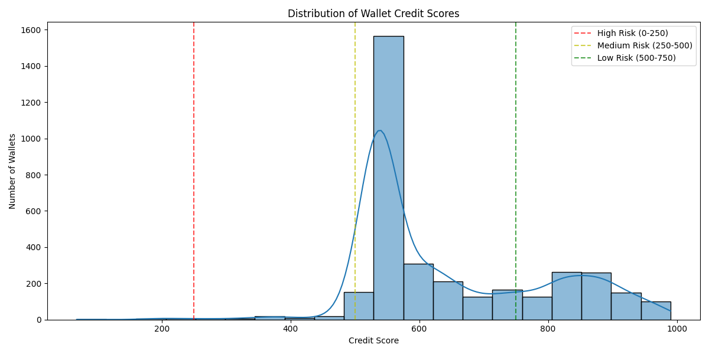
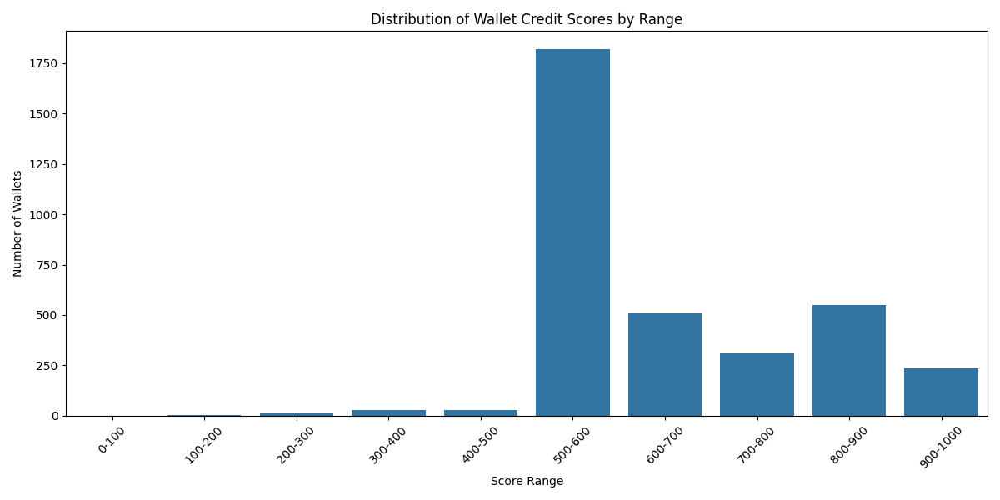
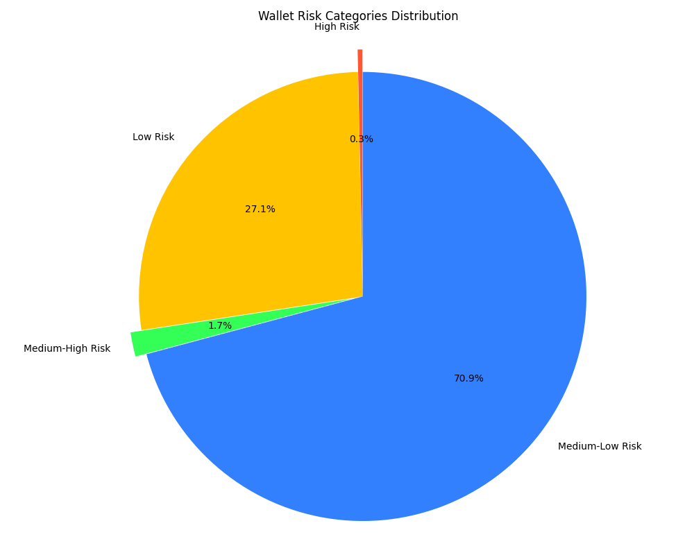
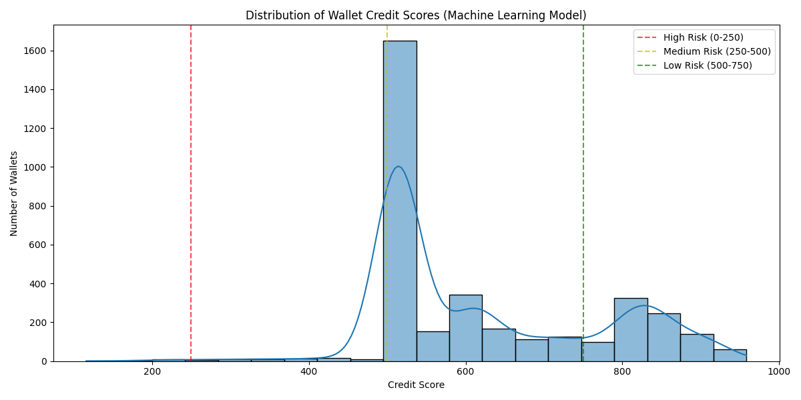
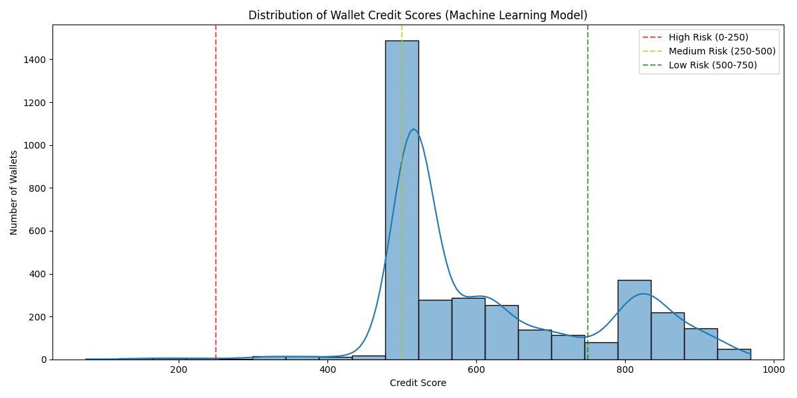
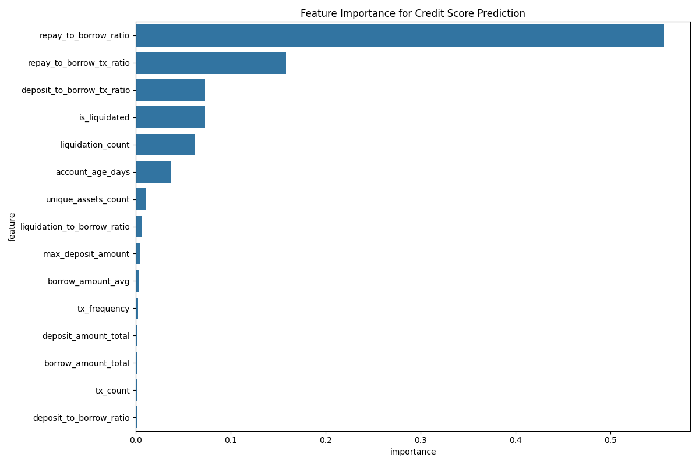

# DeFi Wallet Credit Score Analysis

## Score Distribution

## Score Distribution by Range

### Score Range Analysis

| Score Range | Number of Wallets | Percentage |
|-------------|------------------|------------|
| 0-100 | 1 | 0.03% |
| 100-200 | 5 | 0.14% |
| 200-300 | 12 | 0.34% |
| 300-400 | 27 | 0.77% |
| 400-500 | 28 | 0.80% |
| 500-600 | 1818 | 51.99% |
| 600-700 | 510 | 14.58% |
| 700-800 | 310 | 8.86% |
| 800-900 | 550 | 15.73% |
| 900-1000 | 236 | 6.75% |

## Risk Category Distribution

### High Risk Wallets (0-250)

**Number of Wallets:** 12 (0.34%)

**Statistics:**

- Average Score: 193.25
- Median Score: 198.00
- Min Score: 68
- Max Score: 237

### Medium-High Risk Wallets (250-500)

**Number of Wallets:** 61 (1.74%)

**Statistics:**

- Average Score: 396.34
- Median Score: 390.00
- Min Score: 255
- Max Score: 494

### Medium-Low Risk Wallets (500-750)

**Number of Wallets:** 2478 (70.86%)

**Statistics:**

- Average Score: 571.99
- Median Score: 541.00
- Min Score: 507
- Max Score: 749

### Low Risk Wallets (750-1000)

**Number of Wallets:** 946 (27.05%)

**Statistics:**

- Average Score: 859.27
- Median Score: 860.00
- Min Score: 750
- Max Score: 990

## Machine Learning Model Analysis

### Feature Importance

### Model Comparison

The machine learning model provides a more nuanced credit scoring approach compared to the rule-based model:

1. **Feature Weighting:** The ML model automatically determines optimal feature weights based on patterns in the data
2. **Complex Relationships:** Captures non-linear relationships between features
3. **Adaptability:** Can adapt to changing patterns as new data becomes available

